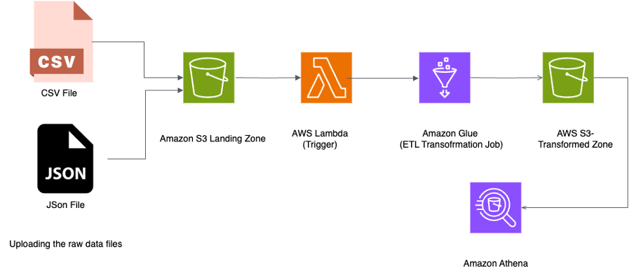

# YT-Insight Hub

A serverless ETL pipeline built on AWS that processes YouTube trending videos data to extract meaningful insights on content performance and audience engagement patterns.



## Project Overview

YT-Insight Hub analyzes trending YouTube videos to identify factors contributing to their popularity across different categories. The cloud-based data pipeline ingests, transforms, and stores YouTube trending video data, enabling analysis of engagement metrics (views, likes, comments), category distribution, and temporal trends.

### Key Features

- **Serverless Architecture**: Utilizes AWS Lambda, S3, and Glue for a fully automated, event-driven pipeline
- **Automated ETL Processes**: Transforms raw YouTube data into structured formats with derived engagement metrics
- **Data Quality Controls**: Implements cleaning operations for text fields and proper data type conversions
- **Advanced Analytics**: Calculates metrics like engagement rate, popularity levels, and trending times
- **Interactive Visualizations**: Pairs with Tableau dashboards to visualize key content performance indicators

## Architecture

The pipeline follows a serverless ETL architecture on AWS:

1. **Data Source**: CSV and JSON files containing YouTube trending video metrics
2. **Data Ingestion**: Files are uploaded to S3 Landing Zone, triggering Lambda functions
3. **Transformation**: AWS Glue jobs process the raw data with Python scripts
4. **Data Storage**: Transformed data is stored in S3 Transformed Zone
5. **Analysis**: Amazon Athena provides SQL querying capabilities for the processed data
6. **Visualization**: Tableau dashboards present insights on video performance metrics

## Key Insights

Analysis of the YouTube trending data revealed:

- Music and Gaming categories receive the highest average views (Music: 1.38M views)
- Nonprofits & Activism category has the highest average dislikes, suggesting controversial content
- Jimmy Kimmel Live, The Ellen Show, and The Tonight Show dominate with high engagement
- Videos take an average of 2.73 days to trend, with some categories trending within a day
- Entertainment category shows the most consistent performance with 332 high and 887 medium popularity videos

## Repository Structure

YT-Insight-Hub/
├── images/
│   └── architecture_diagram.png
├── lambda/
│   └── trigger_etl.py
├── glue/
│   └── transform_youtube_data.py
├── athena/
│   └── youtube_queries.sql
├── sample_data/
│   ├── youtube_sample.csv
│   └── category_sample.json
├── tableau/
│   └── youtube_dashboard.twb
├── docs/
│   ├── data_dictionary.md
│   └── pipeline_setup.md
├── README.md
└── LICENSE

## Setup Instructions

### Prerequisites

- AWS Account with IAM permissions for S3, Lambda, Glue, and Athena
- AWS CLI configured on your local machine
- Python 3.8+ and boto3 library for AWS interactions
- Tableau Desktop for visualization (optional)

### Deployment Steps

1. **Create S3 Buckets:**
   ```bash
   aws s3 mb s3://yt-insight-landing-zone
   aws s3 mb s3://yt-insight-transformed-zone
   cd lambda

2. **Deploy Lambda Function:**

cd lambda
zip -r function.zip .
aws lambda create-function --function-name yt-insight-trigger \
  --runtime python3.8 --handler trigger_etl.lambda_handler \
  --role arn:aws:iam::[YOUR-ACCOUNT-ID]:role/[YOUR-LAMBDA-ROLE] \
  --zip-file fileb://function.zip

3. **Configure S3 Event Trigger:**
   
bashaws lambda add-permission --function-name yt-insight-trigger \
  --statement-id s3-trigger --action lambda:InvokeFunction \
  --principal s3.amazonaws.com \
  --source-arn arn:aws:s3:::yt-insight-landing-zone

4. **Create Glue Job:**
   
Upload the transform_youtube_data.py script to a designated S3 location, then:
bashaws glue create-job --name yt-insight-transform \
  --role arn:aws:iam::[YOUR-ACCOUNT-ID]:role/[YOUR-GLUE-ROLE] \
  --command Name=glueetl,ScriptLocation=s3://[BUCKET]/transform_youtube_data.py \
  --default-arguments '{"--TempDir": "s3://[BUCKET]/temp/"}'

5. **Set Up Athena Table:**

Run the provided SQL queries in the Athena console to create tables for the transformed data.
   
